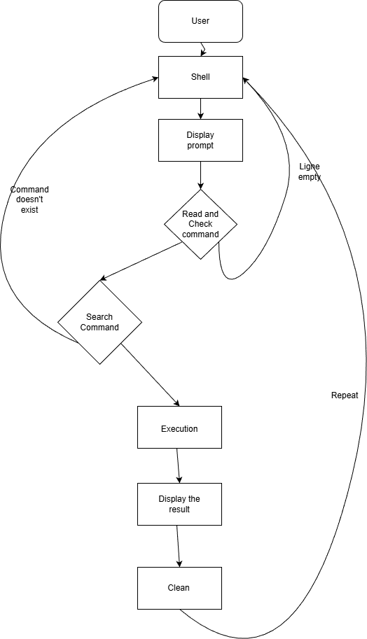

# **C - Simple Shell**

## **Description**
This project is a simple simulation of a UNIX command line interpreter (a tiny shell). It was made in the software development program of [Holberton](https://www.holbertonschool.com/).

### **description of a shell**
A shell is a program that displays a prompt, reads user input, and runs commands by creating a child process (`fork`) and replacing it with a new program (`execve`). The parent process waits for the command to finish, then shows the prompt again.

This version supports **simple command lines**:
- one command only (one word)
- **no arguments**
- **no PATH search** (you must type the full executable path like `/bin/ls`)
- no pipes, redirections, separators, or built-ins

---

## **compilation**
we will compile the code using this command

```bash
gcc -Wall -Werror -Wextra -pedantic -std=gnu89 *.c -o simple_shell
```

---

## **Requirements**

### **Requirements for the project**

**1. Text Editor:** you are allowed to use vi, vim, nano and emacs to modify the code

**2. Operating System:** this project has to be done on Ubuntu 20.04

**3. Coding Style:** you must use the betty style coding and documentation

**4. authorized functions and macros :**
all functions from string.h
access (man 2 access)
chdir (man 2 chdir)
close (man 2 close)
closedir (man 3 closedir)
execve (man 2 execve)
exit (man 3 exit)
_exit (man 2 _exit)
fflush (man 3 fflush)
fork (man 2 fork)
free (man 3 free)
getcwd (man 3 getcwd)
getline (man 3 getline)
getpid (man 2 getpid)
isatty (man 3 isatty)
kill (man 2 kill)
malloc (man 3 malloc)
open (man 2 open)
opendir (man 3 opendir)
perror (man 3 perror)
printf (man 3 printf)
fprintf (man 3 fprintf)
vfprintf (man 3 vfprintf)
sprintf (man 3 sprintf)
putchar (man 3 putchar)
read (man 2 read)
readdir (man 3 readdir)
signal (man 2 signal)
stat (__xstat) (man 2 stat)
lstat (__lxstat) (man 2 lstat)
fstat (__fxstat) (man 2 fstat)
strtok (man 3 strtok)
wait (man 2 wait)
waitpid (man 2 waitpid)
wait3 (man 2 wait3)
wait4 (man 2 wait4)
write (man 2 write)

**5. File Endings:** Ensure that all source code files (.c files) end with a newline character (\n).

**6. Header Inclusion:** Include the "simple_shell.h" header file in all .c files to access necessary declarations and definitions.


## **Flowchart**

```md

```

## **Example Usage**

**Run the shell:**
```bash
./simple_shell
```

**Example session (no PATH, so use full paths):**
```bash
$ /bin/ls
AUTHORS  main.c  simple_shell.h
$ /bin/pwd
/home/tom/projects/simple_shell
$ /bin/echo
Command not found
$ ^D
```

---

## **BUGS**
- This shell only supports **one-word commands** (no arguments).
- This shell does **not** search in `PATH` (you must provide the full executable path).
- No built-ins (`cd`, `exit`, `env`, etc.).
- No pipes, redirections, semicolons, or special characters handling.

---

## **Authors**
- [Thomas CHARIER LERAY](https://github.com/Thomas-lab17).  
- [Arthur MOULARD](https://github.com/arthurmoulard).
